# Build a computer vision based asset inventory app with low / no training

## Introduction

Keeping an up-to-date asset inventory with real devices deployed in the
field can be a challenging and time-consuming task. Many electricity
providers use manufacturer\'s labels as key information to link their
physical assets within asset inventory systems. Computer vision appears
to be a viable solution to speed up operator inspections and reduce
human errors by automatically extracting relevant data from the label.
However, building a standard computer vision application capable of
managing hundreds of different types of labels can be a complex and
time-consuming endeavor. This solution, leveraging generative artificial
intelligence and [large language models
(LLMs)](https://aws.amazon.com/what-is/large-language-model/), aims to
alleviate the time-consuming and labor-intensive tasks required to build
a computer vision application, enabling you to immediately start taking
pictures of your asset labels and extract the necessary information to
update the inventory using AWS services like [AWS
Lambda](https://aws.amazon.com/lambda/), [Amazon
Bedrock](https://aws.amazon.com/bedrock/), [Amazon
Titan](https://aws.amazon.com/bedrock/titan/), [Anthropic's Claude 3 in
Amazon Bedrock](https://aws.amazon.com/bedrock/claude/), [Amazon API
Gateway](https://aws.amazon.com/api-gateway/), [AWS
Amplify](https://aws.amazon.com/amplify/), [Amazon Simple Storage
Service (Amazon S3)](https://aws.amazon.com/s3/) and [Amazon
DynamoDB.](https://aws.amazon.com/dynamodb/)

LLMs are large [deep
learning](https://aws.amazon.com/what-is/deep-learning/) models that are
pre-trained on vast amounts of data. They are capable of understanding
and generating human-like text, making them incredibly versatile tools
with a wide range of applications.  This approach harnesses the image
understanding capabilities of [Anthropic's Claude
3](https://aws.amazon.com/bedrock/claude/) model to extract information
directly from photographs taken on-site, by analyzing the labels present
in those field images. 

## Solution overview

The AI-powered asset inventory labeling solution aims to streamline the
process of updating inventory databases by automatically extracting
relevant information from asset labels through computer vision and
[generative AI](https://aws.amazon.com/generative-ai/) capabilities. The
solution leverages various AWS services to create an end-to-end system
that enables field technicians to capture label images, extract data
using AI models, verify the accuracy, and seamlessly update the
inventory database. 

Let's take a detailed look at the solution architecture below. 

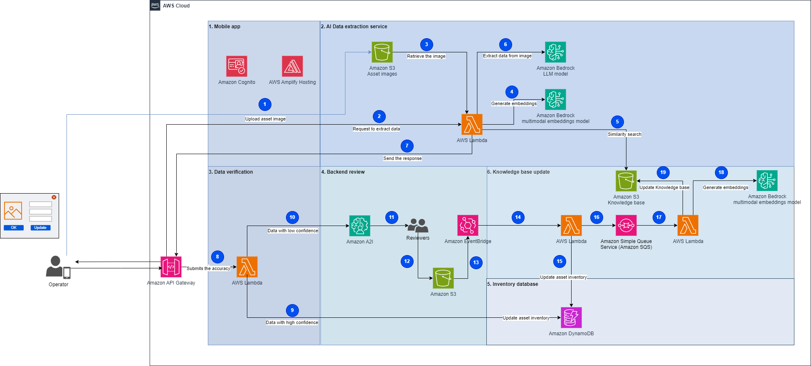{width="5.853210848643919in"
height="2.633027121609799in"}

**Figure 1: Solution architecture overview**

### How it works

1.  The process starts when an operator takes and uploads a picture of
    the assets using the mobile app.

2.  The operator then submits a request to extract data from the asset
    image.

3.  An [AWS Lambda](https://aws.amazon.com/lambda/) function retrieves
    the uploaded asset image from the uploaded images data store.

4.  The function generates the asset image
    [embeddings](https://aws.amazon.com/what-is/embeddings-in-machine-learning/)
    (vector representations of data) invoking the [Amazon Titan
    Multimodal Embeddings
    G1](https://docs.aws.amazon.com/bedrock/latest/userguide/titan-multiemb-models.html)
    model.

5.  The function performs a similarity search in the knowledge base to
    retrieve similar asset labels. The most relevant results will
    augment the prompt as similar examples to improve the response
    accuracy, and sent with the instructions to the LLM to extract data
    from the asset image.

6.  Then the function invokes [Anthropic's Claude 3
    Sonnet](https://aws.amazon.com/bedrock/claude/) via Amazon Bedrock
    to extract data (serial number, vendor name, and so on) using the
    augmented prompt and the related instructions.

7.  The function sends back the response to the mobile app with the
    extracted data.

8.  The mobile app verifies the extracted data and assigns a confidence
    level. It invokes the API to process the data. Data with high
    confidence will be directly ingested into the system.

9.  An AWS Lambda function is invoked to update the asset inventory
    database with the extracted data if the confidence level has been
    indicated as high by the mobile app.

10. The function sends data with low confidence to [Amazon Augmented AI
    (A2I)](https://aws.amazon.com/augmented-ai/) for further processing.

11. The human reviewers from Amazon Augmented AI validate or correct the
    low-confidence data.

12. Human reviewers, such as subject matter experts, validate the
    extracted data, flag it, and store it in an Amazon S3 bucket. 

13. A rule in [Amazon
    EventBridge](https://aws.amazon.com/it/eventbridge/) is defined in
    order to trigger an AWS Lambda function to get the information from
    the S3 bucket when the A2I workflow processing is completed

14. An AWS Lambda function processes the output of the A2I workflow by
    loading data from the JSON file that stored backend
    operator-validated information.

15. The function updates the asset inventory database with the new
    extracted data.

16. The function sends the extracted data marked as new by human
    reviewers to an SQS queue in order to be further processed.

17. Another AWS Lambda function fetches messages from the queue and
    serializes the updates to the knowledge base database.

18. The function generates the asset image embeddings invoking the
    Amazon Titan Multimodal Embeddings G1 model.

19. The function updates the knowledge base with the generated
    embeddings and notifies other functions that the database has been
    updated

Let's have a closer look at the solution:

#### 1. Mobile app

The Mobile app component plays a crucial role in this AI-powered asset
inventory labeling solution. It serves as the primary interface for
field technicians on their tablets or mobile devices to capture and
upload images of asset labels using the device\'s camera.

The implementation of the mobile app includes an authentication
mechanism that will allow access only to authenticated users. It is also
built using a serverless approach in order to minimize recurring costs
and have a highly scalable and robust solution.

The Mobile app has been built using the following services:

- [Amazon Cognito](https://aws.amazon.com/cognito/): This handles user
  authentication and authorization for the mobile app.

- [AWS Amplify](https://aws.amazon.com/amplify/): This provides a
  development framework and hosting for the static content of the Mobile
  App. By leveraging AWS Amplify, the mobile app component benefits from
  features like seamless integration with other AWS services, offline
  capabilities, secure authentication, and scalable hosting. 

#### 2. AI Data extraction service

The AI Data extraction service is designed to extract critical
information, such as manufacturer name, model number, and serial number
from images of asset labels.

To enhance the accuracy and efficiency of the data extraction process,
the service employs a knowledge base comprising of sample label images
and their corresponding data fields. This knowledge base serves as a
reference guide for the AI model, enabling it to learn and generalize
from labeled examples to new label formats effectively. The knowledge
base is stored as vector embeddings in a high-performance vector
database: [Meta\'s FAISS](https://ai.meta.com/tools/faiss/) (Facebook AI
Similarity Search), hosted on Amazon S3 object storage service.

Embeddings are dense numerical representations that capture the essence
of complex data like text or images in a vector space. Each data point
is mapped to a vector or ordered list of numbers, where similar data
points are positioned closer together. This embedding space allows for
efficient similarity calculations by measuring the distance between
vectors. Embeddings enable machine learning models to effectively
process and understand relationships within complex data, leading to
improved performance on various tasks like natural language processing
and computer vision.

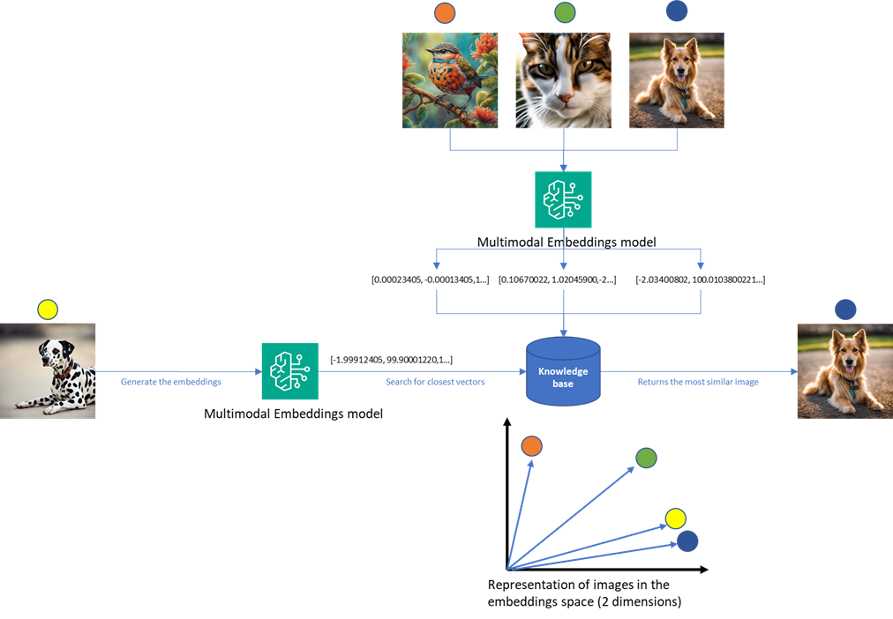{width="5.853210848643919in"
height="4.055044838145232in"}

The vector embeddings are generated using Amazon Titan, a powerful
embedding generation service, which converts the labeled examples into
numerical representations suitable for efficient similarity searches.

- When a new asset label image is submitted for processing, the AI Data
  Extraction Service, through an AWS Lambda function, retrieves the
  uploaded image from the bucket where it was uploaded;

- Performs a similarity search using [Meta\'s
  FAISS](https://ai.meta.com/tools/faiss/) vector search engine. This
  search compares the new image against the vector embeddings in the
  knowledge base generated by Amazon Titan Multimodal Embeddings invoked
  through Amazon Bedrock, identifying the most relevant labeled
  examples. 

- Using the augmented prompt with context information from the
  similarity search, the Lambda then invokes Amazon Bedrock,
  specifically Anthropic\'s Claude v3, a state-of-the-art generative AI
  model, for image understanding and optical character recognition (OCR)
  tasks. By leveraging the similar examples, the AI model can more
  accurately extract and interpret the critical information from the new
  asset label image.

- The response is then sent to the Mobile App in order to be confirmed
  by the field technician.

In this phase, the AWS Services used are:

- [Amazon Simple Storage Service (Amazon
  S3)](https://aws.amazon.com/s3/): Amazon Simple Storage Service offers
  industry leading durability, availability, performance, security, and
  virtually unlimited scalability at low costs used to store the asset
  images uploaded by the field technicians. 

- [AWS Lambda](https://aws.amazon.com/lambda/): A serverless computing
  service that allows you to run your code without the need to provision
  or manage physical servers or virtual machines. An AWS Lambda runs the
  data extraction logic and orchestrates the overall data extraction
  process.

- [Amazon Bedrock](https://aws.amazon.com/bedrock/): A fully managed
  service that offers a choice of high-performing foundation models
  (FMs) from leading AI companies like AI21 Labs, Anthropic, Cohere,
  Meta, Mistral AI, Stability AI, and Amazon through a single API, along
  with a broad set of capabilities 

#### 3. Data verification

Data Verification plays a crucial role in ensuring the accuracy and
reliability of the extracted data before updating the Asset Inventory
database and is included in the Mobile app. 

This allows:

- The display of the extracted data to the field operator. If the field
  operator determines that the extracted data is accurate and matches an
  existing asset label in the knowledge base, he can confirm the
  correctness of the extraction; if not, he can update the values
  directly using the app.

- Once the field technician confirms the data are correct, that
  information is automatically forwarded to the backend review
  component.

Data Verification leverages the following AWS services:

- [AWS Lambda](https://aws.amazon.com/lambda/): Serverless functions for
  implementing the verification logic and routing data based on
  confidence levels.

- [Amazon API Gateway](https://aws.amazon.com/api-gateway/): A secure
  and scalable API gateway that exposes the Data Verification
  component\'s functionality to the mobile app and other components.

#### 4. Backend review

This component assesses the discrepancy of automatically identified data
by the AI Data Extraction service and the final data approved by the
field operator and compute the difference. If the difference is below a
configured threshold, the data is sent to update the Inventory database;
otherwise a human review process is engaged:

- Subject matter experts asynchronously review flagged data entries in
  the [Amazon Augmented AI (A2I)](https://aws.amazon.com/augmented-ai/)
  console. 

- Significant discrepancies are marked to update the generative AI\'s
  knowledge base. 

- Minor OCR errors are corrected without updating the AI model's
  knowledge base.

The Backend review component leverages the following AWS services:

- [Amazon Augmented AI (A2I)](https://aws.amazon.com/augmented-ai/): A
  service that provides a web-based interface for human reviewers to
  inspect and correct the extracted data and asset label images.

- [Amazon S3](https://aws.amazon.com/s3/): Object storage to save the
  marked information in charge of Amazon Augmented AI (A2I)

- [Amazon EventBridge](https://aws.amazon.com/eventbridge/): Serverless
  service that uses events to connect application components
  together. When the Amazon A2I human workflow is completed, Amazon
  EventBridge is used to detect this event and trigger a Lambda function
  to process the output data.

#### 5. Inventory database

The inventory database component plays a crucial role in storing and
managing the verified asset data in a scalable and efficient manner.
[Amazon DynamoDB](https://aws.amazon.com/it/dynamodb/), a fully managed
NoSQL database service from AWS, is utilized for this purpose. Amazon
DynamoDB is a serverless, scalable, and highly available key-value and
document database service. It is designed to handle massive amounts of
data and high traffic workloads, making it well-suited for storing and
retrieving large-scale inventory data.

 

The verified data from the AI extraction and human verification
processes is ingested into the DynamoDB table. This includes data with
high confidence from the initial extraction, as well as data that has
been reviewed and corrected by human reviewers. 

#### 6. Knowledge base update

The knowledge base update component enables continuous improvement and
adaptation of the generative AI models used for asset label data
extraction. During the Backend review process, human reviewers from A2I
validate and correct the data extracted from asset labels by the AI
model. 

The corrected and verified data, along with the corresponding asset
label images, are marked as new label examples if not already present in
the knowledge base.

An AWS Lambda function is triggered to update the Asset inventory and
sends the new label to the FIFO queue.

An AWS Lambda function processes the messages in the queue, updating the
knowledge base vector store (Amazon S3 bucket) with the new label
examples. The update process consists in generating the vector
embeddings invoking the Amazon Titan Multimodal Embeddings G1 model
exposed by Amazon Bedrock and storing the embeddings in a Meta's FAISS
database in Amazon S3.

The knowledge base update process makes sure that the solution remains
adaptive and continuously improves its performance over time, reducing
the likelihood of unseen label examples and the involvement of subject
matter experts to correct the extracted data.

This component leverages on the following AWS services:

- [Amazon Simple Queue Service (Amazon
  SQS)](https://aws.amazon.com/sqs/):  Fully-managed message queuing for
  microservices, distributed systems, and serverless applications. The
  extracted data marked as new by human reviewers are sent to an [Amazon
  SQS FIFO
  (First-In-First-Out)](https://docs.aws.amazon.com/AWSSimpleQueueService/latest/SQSDeveloperGuide/welcome.html)
  queue. This makes sure that the messages are processed in the correct
  order; FIFO queues preserve the order in which messages are sent and
  received. If you use a FIFO queue, you don\'t have to place sequencing
  information in your messages. 

- [AWS Lambda](https://aws.amazon.com/lambda/) functions are used to
  update the Asset inventory database, to send and process the extracted
  data to the FIFO queue, and to update the knowledge base in case of
  new unseen labels.

- [Amazon Bedrock Titan Multimodal Embeddings G1
  model:](https://docs.aws.amazon.com/bedrock/latest/userguide/titan-multiemb-models.html)
  This model generates the embeddings (vector representations) for the
  new asset images and their associated data.

- [Amazon S3](https://aws.amazon.com/pm/serv-s3/): The knowledge base is
  stored in an Amazon S3 bucket, with the newly generated embeddings.
  This allows the AI system to improve its accuracy for future asset
  label recognition tasks.

### Navigation Flow

#### 1. Mobile App  

The end user will have access to the mobile app using the browser
included in the handheld device. The *application url* to access the
mobile app is available once you have deployed the front-end
application. Using the browser on a handheld device or your PC, browse
to the *application url* address where a login windows will appear.
Since this is a demo environment, you can register on the application by
following the automated registration workflow implemented through Amazon
Cognito and clicking on "Create Account", as shown in the following
image.

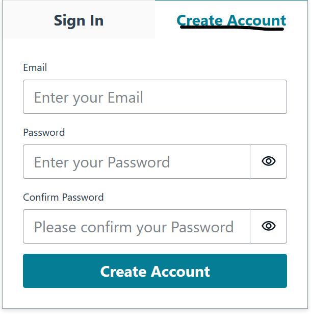{width="5.5963298337707785in"
height="5.6422014435695536in"}

During the registration process, you must provide a valid email address
that will be used in order to verify your identity, and define a
password. Once registered you can now log in with your credentials.

After authentication is complete, the application appears on your
screen, as shown in the following image.

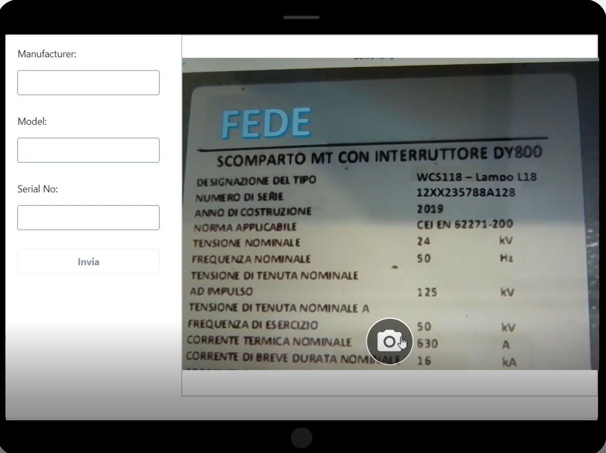{width="5.853210848643919in"
height="4.376146106736658in"}

The process to use the application is the following:

- Use the camera button to capture a label image

- The app then facilitates the upload of the captured image to a private
  S3 bucket specifically designated for storing asset images. [S3
  Transfer
  Acceleration](https://aws.amazon.com/s3/transfer-acceleration/) is a
  separate AWS service that can be integrated with Amazon S3 to improve
  the transfer speed of data uploads and downloads. It works by using
  AWS edge locations, which are globally distributed and closer to the
  client applications, as intermediaries for data transfer. This reduces
  the latency and improves the overall transfer speed, especially for
  clients that are geographically distant from the S3 bucket\'s
  [Region](https://aws.amazon.com/about-aws/global-infrastructure/regions_az). 

- Once the image is uploaded, the app sends a request to the AI Data
  Extraction Service, triggering the subsequent process of data
  extraction and analysis. The extracted data returned by the service is
  displayed and editable within the form as described below. This allows
  for data verification.

#### 2. AI Data Extraction Service 

This module utilizes Anthropic\'s Claude v3 Foundation Model, a
multimodal system capable of processing both images and text. To extract
relevant data, we employ a prompt technique that uses samples to guide
the model\'s output. Our prompt includes two sample images along with
their corresponding extracted text. The model identifies which sample
image most closely resembles the one we want to analyze and uses that
sample\'s extracted text as a reference to determine the relevant
information in the target image.

The prompt we are using to achieve this result is the following:

{\
\"role\": \"user\",\
\"content\": \[\
{\
\"type\": \"text\",\
\"text\": \"first_sample_image:\",\
},\
{\
\"type\": \"image\",\
\"source\": {\
\"type\": \"base64\",\
\"media_type\": \"image/jpeg\",\
\"data\": first_sample_encoded_image,\
},\
},\
{\
\"type\": \"text\",\
\"text\": \"target_image:\",\
},\
{\
\"type\": \"image\",\
\"source\": {\
\"type\": \"base64\",\
\"media_type\": \"image/jpeg\",\
\"data\": encoded_image,\
},\
},\
{\"type\": \"text\",\
\"text\": f\"\"\"\
answer the question using the following example as reference.\
match exactly the same set of fields and information as in the provided
example.\
\
\<example\>\
analyze first_sample_image and answer with a json file with the
following information: Model, SerialN, ZOD.\
answer only with json.\
\
Answer:\
**{first_sample_answer}**\
\</example\>\
\
\<question\>\
analyze target_image and answer with a json file with the following
information: Model, SerialN, ZOD.\
answer only with json.\
\
Answer:\
\</question\>\
\"\"\"},\
\
\],\
}

Where **first_sample_encoded_image** and **first_sample_answer** are the
reference image and expected output respectively,
while **encoded_image** contains the new image that has to be analyzed.

#### 3. Data Verification    Once the image is processed by the AI Data Extraction Service, the control goes back to the mobile app:

- The mobile app receives the extracted data from the **AI Data
  Extraction Service**, which has processed the uploaded asset label
  image and extracted relevant information using computer vision and
  machine learning models.

- Upon receiving the extracted data, the mobile app presents it to the
  field operator, allowing him to review and confirm the accuracy of the
  information (see image below). If the extracted data is correct and
  matches the physical asset label, the technician can submit a
  confirmation through the app, indicating that the data is valid and
  ready to be inserted into the Asset Inventory database.

- However, if the field operator sees any discrepancies or errors in the
  extracted data compared to the actual asset label, he has the option
  to correct those values.

- The values returned by the **AI Data Extraction Service** and the
  final values validated by the field operators are sent to the
  **Backend Review** service.

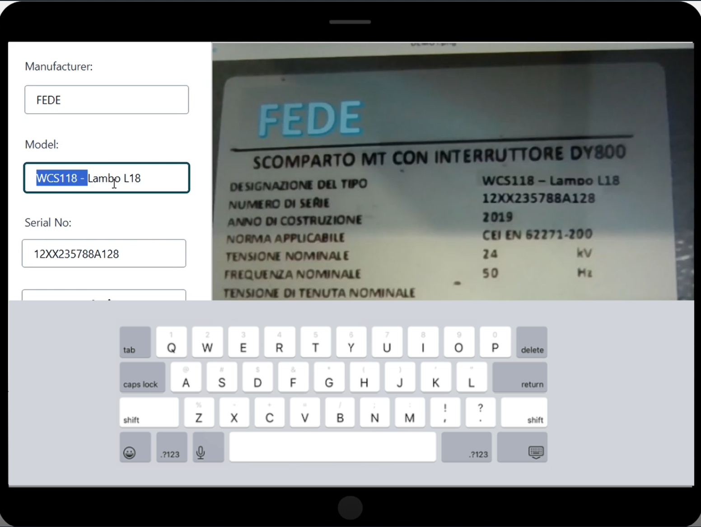{width="5.853210848643919in"
height="4.394494750656168in"}

#### 4. Backend Review

This process is implemented using Amazon Augmented AI (A2I).

A distance metric is computed to evaluate the difference between what
the Data Extraction Service has identified and the correction performed
by the on-site operator. If the difference is larger than a predefined
threshold, then the image and the operator modified data are submitted
to an A2I workflow creating a human in the loop request.

As soon as a backend operator becomes available, the new request is
assigned. The operator will use the A2I provided web interface, as
depicted in the following picture, to check what the on-site operator
has done and, if it's found that this type of label is not included in
the knowledge base, can decide to add it by entering Yes in the "Add to
Knowledge Base".

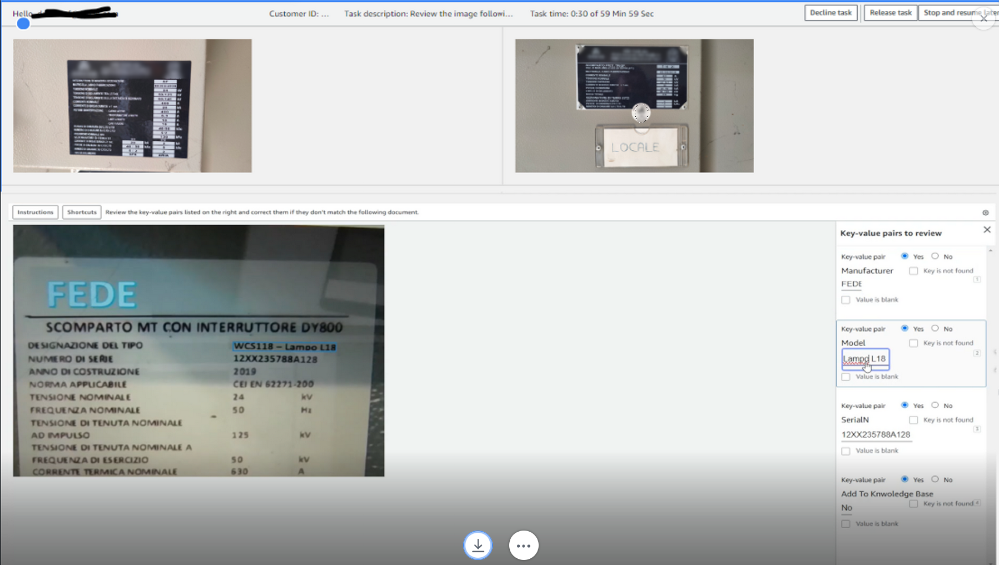{width="5.853210848643919in"
height="3.311925853018373in"}

When the A2I process is completed, a Lambda function is triggered. This
Lambda function stores the information in the Inventory Database and
verifies if this image also needs to be used to update the Knowledge
Base. If this is the case, the Lambda function files the request with
the relevant data in a FIFO SQS Queue.

#### 5. Inventory Database 

To keep this solution as simple as possible while covering the required
capability, we selected Amazon DynamoDB as our inventory database.

This is a no SQL database and we will store data in a table with the
following information.

- Manufacturers, ModelId, and the Serial \# that is going to be the key
  of the table.

- A link to the picture containing the label used during the on-site
  inspection.

Amazon DynamoDB offers the on-demand pricing model which allows costs to
directly depend on actual database usage.

#### 6. Knowledge Base Database

The Knowledge Base database is stored as two files in an S3 bucket.

The first file is a JSON array containing the metadata (Manufacturer,
Serial#, Model ID, link to reference image) for each of the knowledge
base entries. The second file is a FAISS database containing an index
with the embedding for each of the images included in the first file.

In order to be able to minimize race conditions when updating the
database, a single Lambda function is configured as the consumer of the
SQS queue.

Lambda extracts the information about the link to the reference image
and the metadata, certified by the back-office operator, updates both
files, and stores the new version in the S3 bucket.

## Solution deployment

In the following sections, we will create a seamless workflow for field
data collection, AI-powered extraction, human validation, and inventory
updates.

### Prerequisites

You need the following prerequisites before you can proceed with
solution. For this post, we use the us-east-1 Region. You will also need
an IAM user with administrative privileges in order to deploy all the
required components and a development environment with access to AWS
resources already configured. 

For the development environment, you can use an Amazon EC2 instance,
~~(~~please select at least a t3.small instance type in order to be able
to build the web application) or use a development environment of your
own choice. Install Python 3.9 and install and configure [AWS Command
Line Interface (AWS CLI)](https://aws.amazon.com/cli/)

You will also need to install the AWS Amplify CLI. Please refer to this
[guide](https://docs.amplify.aws/gen1/javascript/tools/cli/start/set-up-cli/)
for more info.

The next step is to go to the Amazon Bedrock console and enable the
following models used in this workshop. To do this, log into the AWS
Console, go to [Amazon Bedrock
page](https://us-east-1.console.aws.amazon.com/bedrock/home?region=us-east-1#/)
and select Model access in the left menu. Click the Enable specific
models button like in the following image.

- Anthropic Claude models

- Amazon Titan models 

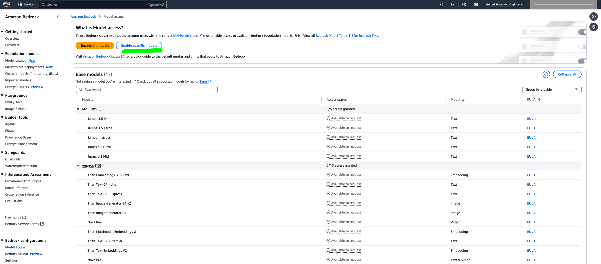{width="5.844036526684165in"
height="2.577981189851269in"}

Select all Anthropic and Amazon models as in the following screenshot
and click **Next** at the bottom of the page:

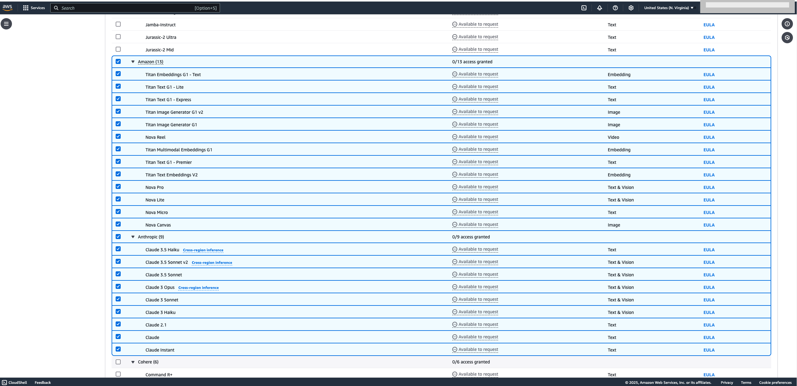{width="5.853210848643919in"
height="2.8348622047244096in"}

A new window will list the requested models. Check that the Amazon Titan
models and Anthropic Claude models are in this list and click the
**Submit** button.

The next step is to create an Amazon SageMaker Ground Truth private
labeling workforce that will be used to perform back-office activities.
If you do not already have a private labeling workforce in your account,
you can create one following the instructions below. 

Log into the Amazon Sagemaker console using this
[link](https://console.aws.amazon.com/sagemaker/).

In the left panel, select Ground Truth and Labelling workforce like in
the following picture:

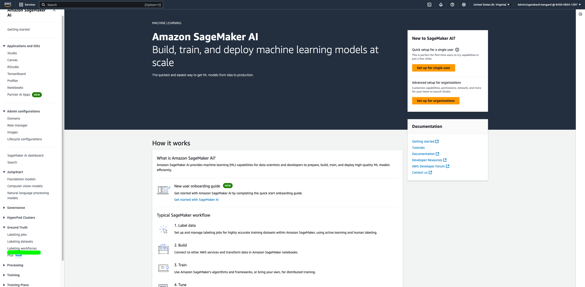{width="5.853210848643919in"
height="2.8623851706036745in"}

Select Private tab and Create private team like in the picture below:

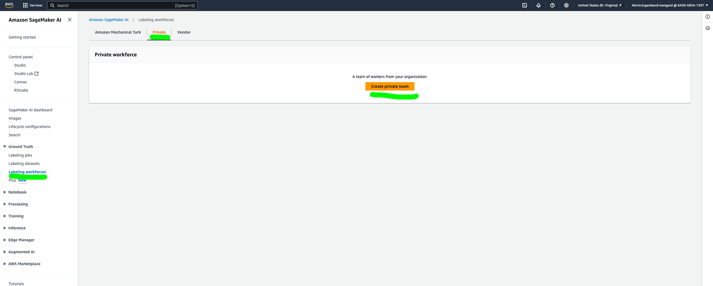{width="5.853210848643919in"
height="2.3486231408573928in"}

Provide a name to the team and your organization, insert your email
address (must be a valid one) for both Email addresses and in Contact
email. Leave all the other options as default.

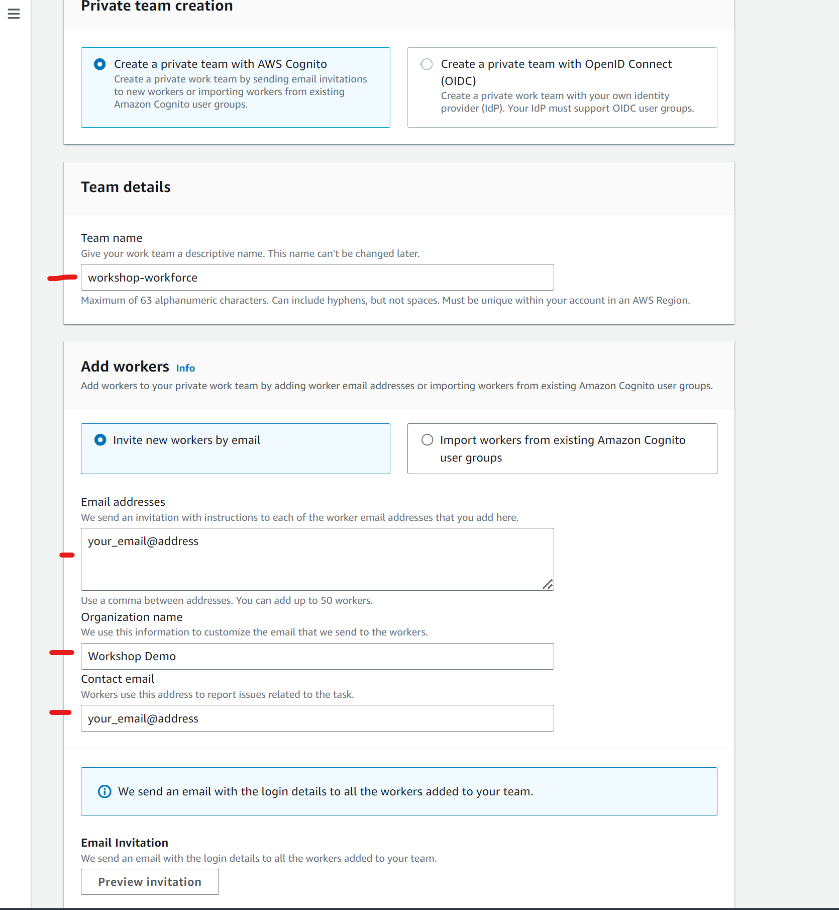{width="5.853210848643919in"
height="6.339448818897638in"}

Click Create Private team at the bottom of the page.

Once your workforce is created, copy your workforce ARN from
this [link](https://console.aws.amazon.com/sagemaker/groundtruth?#/labeling-workforces)
and selecting Private tab and save for later use, as shown in the
following picture.

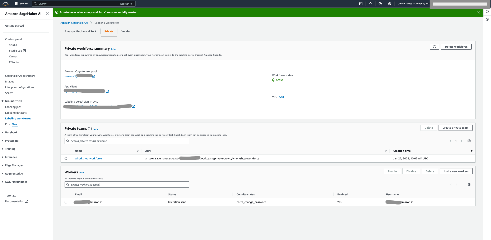{width="5.853210848643919in"
height="2.8715594925634296in"}

Lastly, build an Amazon Lambda layer that includes two Python libraries.
To build this layer, connect to your development environment and issue
the following commands:

git
clone <https://gitlab.aws.dev/dalesf/cv-asset-inventory-app-with-low-no-training-data>\
cd cv-asset-inventory-app-with-low-no-training-data\
bash build_lambda_layer.sh

You should get an output similar to the following screenshot:

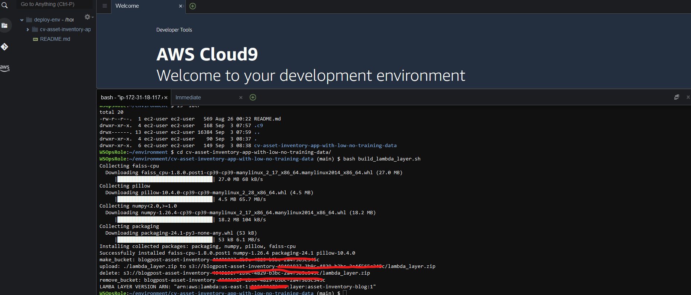{width="5.853210848643919in"
height="2.5045866141732285in"}

Save the LAMBDA_LAYER_VERSION_ARN for later use.

You are now ready to follow the deployment procedure.

### Deployment Procedure

The solution deployment involves 2 steps: 

1.  Deploy backend infrastructure 

2.  Deploy frontend application

#### Deploy back end infrastructure 

The backend is deployed using [AWS
CloudFormation](https://aws.amazon.com/cloudformation/) to build the
following components:

- An Amazon API Gateway to act as an integration layer between the
  frontend app and the backend

- An Amazon S3 bucket to store the uploaded images and the knowledge
  base

- Amazon Cognito to allow end user authentication

- A set of AWS Lambda functions to implement backend services

- An Amazon A2I Workflow to support the back-office activities

- An Amazon SQS queue to store knowledge base update requests

- An Amazon EventBridge rule to trigger a Lambda function as soon as an
  A2I Workflow is completed

- An Amazon Dynamo DB table to store inventory data

- AWS IAM roles and policies to allow access to the different components
  to interact with each other and also access Amazon Bedrock for
  generative AI related tasks

 The CloudFormation template used in this step can be downloaded from
[here](https://gitlab.aws.dev/dalesf/cv-asset-inventory-app-with-low-no-training-data/-/blob/main/cloud-formation.yaml)

 In order to deploy the CloudFormation template, use the AWS Console
using this
[link](https://us-east-1.console.aws.amazon.com/cloudformation).\
 

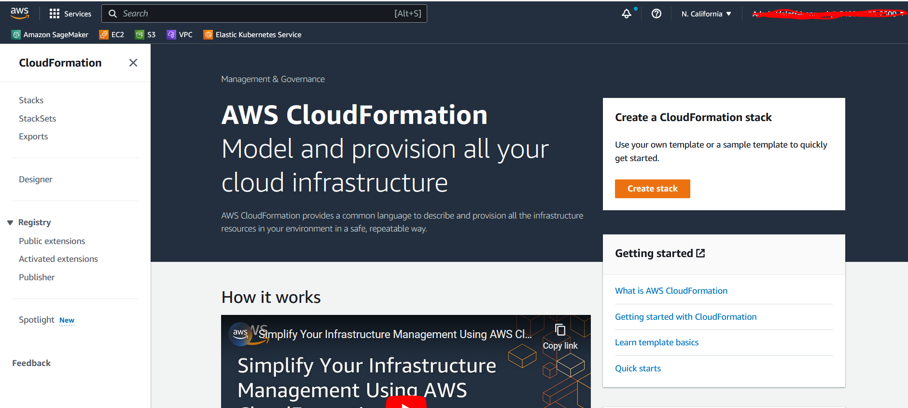{width="5.852083333333334in"
height="2.3444444444444446in"}This will open a new window in your
browser similar to the following picture

Click on **Create stack**. In the next form, select **Upload a template
file** and use the **Choose file** button to upload the previously
downloaded template.

Click **Next** and fill the **Stack name** field with
**asset-inventory**. Fill in the parameters with the information
collected during the prerequisites step as follows:

-  A2IWorkforceARN with the ARN of the labelling workforce you
  identified 

-  LambdaLayerARN with the ARN of the Lambda layer version you uploaded 

Select **Next** and **Next** again. In the last screen acknowledge that
CloudFormation is going to create AWS Identity and Access Management
(IAM) resources and then click **Submit.**

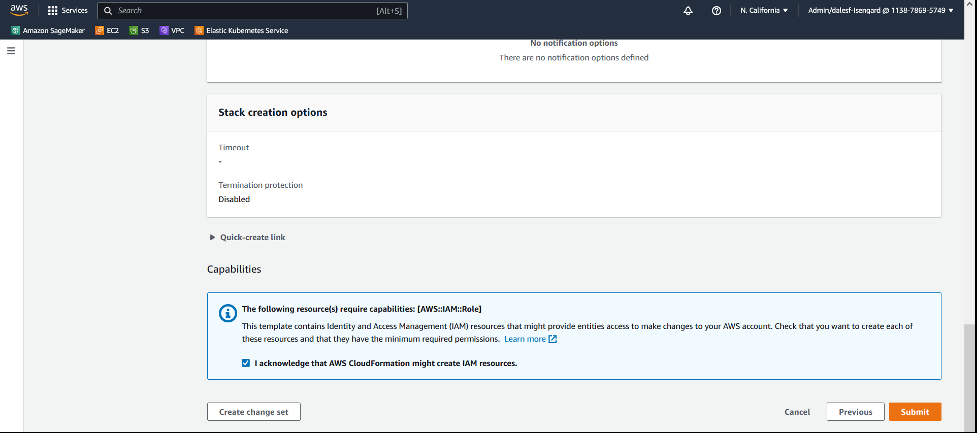{width="5.852083333333334in"
height="2.3520833333333333in"}

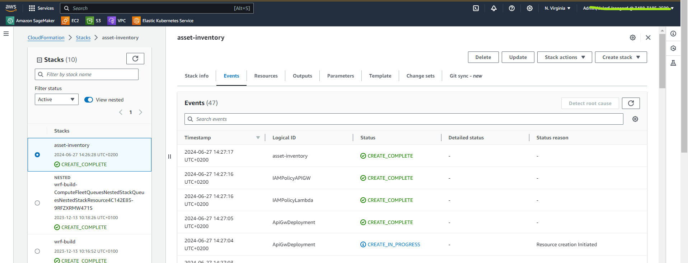{width="5.852083333333334in"
height="2.0034722222222223in"}Wait until the CloudFormation stack
creation process completes; it will take about 15 - 20 minutes. At the
end you will see something similar to the following picture.

Select the **Outputs** tab to show you an image similar to the
following. You will use the output data later on to complete the
configuration of the frontend application.

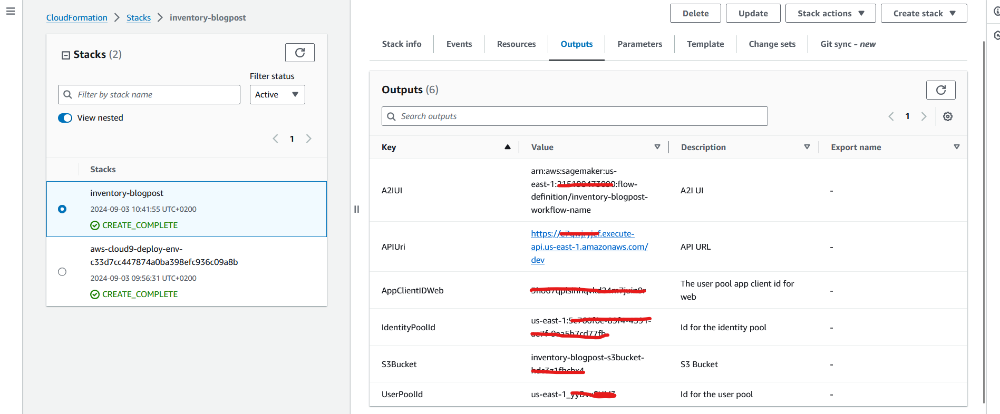{width="5.853210848643919in"
height="2.422017716535433in"}

#### Deploy the frontend application

In this section you will build the web application that is used by the
on-site operator to collect a picture of the labels, submit it to the
backend services to extract relevant information, validate or correct
returned information, and submit the validated or corrected information
to be stored in the asset inventory.

The web application uses React and will use the Amplify Javascript
Library.

Amplify provides several products to build full stack apps:

- [Amplify CLI](https://docs.amplify.aws/cli/) -- A simple command line
  interface to set up the needed services.

- [Amplify Libraries](https://docs.amplify.aws/lib/q/platform/js/) --
  Use case-centric client libraries to integrate the frontend code with
  the backend.

- [Amplify UI Components](https://ui.docs.amplify.aws/) -- UI libraries
  for React, React Native, Angular, Vue and Flutter.

In this example, you already created the needed services with the
CloudFormation templates, so the Amplify CLI will deploy the application
on the AWS Amplify-provided hosting service.

Log into your development environment and download the client code from
this [github
repository](https://gitlab.aws.dev/dalesf/cv-asset-inventory-app-with-low-no-training-data)
using the following command:

git clone
<https://gitlab.aws.dev/dalesf/cv-asset-inventory-app-with-low-no-training-data>\
cd cv-asset-inventory-app-with-low-no-training-data\
cd webapp

If you are running on Cloud9 as a development environment, issue the
following command in order to let the AWS Amplify CLI use Cloud9-managed
credentials:

ln -s \$HOME/.aws/credentials \$HOME/.aws/config

Now you can init the Amplify application using the CLI:

amplify init

After issuing this command, the Amplify CLI will ask you for some
parameters. Accept the default values by pressing "Enter" for each
question.

The next step is to modify *amplifyconfiguration*.*js.template (you can
find it in folder webapp/src) *with the information collected from the
output of the CloudFormation stack and save as
*amplifyconfiguration*.*js*.

This file tells Amplify which is the correct endpoint to use to interact
with the backend resources created for this application.

The list of information required are the following:

- *aws_project_region* and *aws_cognito_region*: to be filled in with
  the Region in which you run the CloudFormation template (i.e.
  us-east-1)

- *aws_cognito_identity_pool_id, aws_user_pools_id,
  aws_user_pools_web_client_id*: The value from the Output panel of
  CloudFormation

- In the API section:

  - Endpoint: Update this with the API Gateway URL listed in the output
    panel of CloudFormation 

You now need to add a hosting option for the single page application.
You can use Amplify to configure and host the web application by issuing
the following command:

amplify hosting add

The Amplify CLI will ask you which type of hosting service you prefer
and what type of deployment. Answer both questions by accepting the
default option by pressing the "Enter" key.

You now need to install all of the javascript libraries used by this
application leveraging npm:

npm install

You are now ready to deploy the app using the following command:

amplify publish

During the deployment, Amplify will ask you to confirm if you want to
proceed, please confirm by answering Y.

At the end of the deployment phase, Amplify will return the public URL
of the web application, similar to the following:

\...\
Find out more about deployment here:\
\
<https://cra.link/deployment>\
\
✔ Zipping artifacts completed.\
✔ Deployment complete!\
<https://dev.d371z20frvpdj1.amplifyapp.com>

Use your browser to connect to the app using the provided URL and\....
have fun!

## Cleanup

In order to delete the resources used to build this solution, you first
need to delete the Amplify application by issuing the following command:

amplify delete

and confirm that you are willing to delete the application.

Remove the backend resources by going to the CloudFormation console
using the
following [link](https://us-east-1.console.aws.amazon.com/cloudformation/home?region=us-east-1)
and deleting the stack as shown in the picture below.

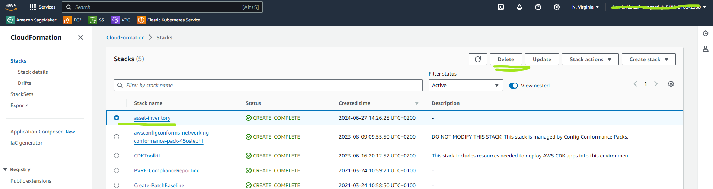{width="5.851388888888889in"
height="1.3347222222222221in"}A pop-up window will ask you to confirm
the deletion. Click the **Delete** button in the pop-up window.

At the end of the deletion process ,you should not see the entry related
to *asset-inventory* within the list of stacks.

Finally, remove the Lambda layer by issuing the following command in the
development environment:

aws lambda delete-layer-version ---layer-name asset-inventory-blog
---version-number 1

If you created a new Labelling Workforce, remove it by using the
following command:

aws delete-workteam ---workteam-name \<the name you defined when you
created the workteam\>

## Conclusion

The solution architecture incorporates various AWS services to handle
image storage (S3), mobile app development (AWS Amplify), AI model
hosting (Amazon Bedrock leveraging Anthropic's Claude), data
verification (Augmented AI), database (Amazon DynamoDB), and vector
embeddings (Amazon Bedrock leveraging Amazon Titan Multimodal
Embedding). 

It creates a seamless workflow for field data collection, AI-powered
extraction, human validation, and inventory updates. 

By leveraging AWS\'s breadth of services and integrating generative AI
capabilities, this solution dramatically improves the efficiency and
accuracy of asset inventory management processes. It reduces manual
labor, accelerates data entry, and maintains high-quality inventory
records, enabling organizations to optimize asset tracking and
maintenance operations.

Now you can deploy this solution and immediately start collecting images
of your assets to build or update your asset inventory.

## About Authors

Elisabetta Castellano is an AWS Solutions Architect who helps customers
harness the power of the cloud. Her expertise focuses on machine
learning and generative AI, with the goal of democratizing the adoption
of these transformative technologies to solve business problems.  When
she\'s not immersed in the world of cloud computing, Elisabetta enjoys
reading books, listening to music, and indulging in her love of
movies.  

Leonardo Fenu is an AWS Solutions Architect, who has been helping
customers align their technology with their business goals since 2018.
When not hiking in the mountains, he enjoys tinkering with hardware and
software, exploring the latest cloud technologies, and finding creative
ways to solve complex problems.

Federico D'Alessio is an AWS Solutions Architect and joined AWS in 2018.
He is currently working on Power and Utility and Transportation market.
Federico is cloud addict and when not at work he tries to reach clouds
with his hang glider.

Carmela Gambardella is an AWS Solutions Architect since April 2018.
Before AWS, Carmela has held various roles in large IT companies, such
as software engineer, security consultant and solutions architect. She
has been using his experience in security, compliance and cloud
operations to help public sector organizations in their transformation
journey to the cloud. In her spare time, she is a passionate reader, she enjoys hiking,
travelling and playing yoga.
